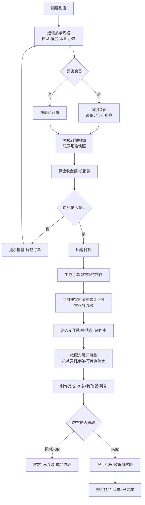

# 奶茶店经营数据库

数据库实验课程贯穿项目 · 单店奶茶店经营场景 · 17 周

## 项目范围

以**一家奶茶店**为经营场景，在 17 周内把同一个数据库项目从记录业务逐步建设为支持经营分析与补货决策的应用。

| 项 | 设定 |
|---|---|
| 门店数量 | 1 家（单店，不做连锁） |
| 菜单规模 | 约 30 款成品 |
| 原料规模 | 约 60 种 |
| 营业模式 | 堂食 + 自提（**不接**外卖平台） |
| 当前进度 | **第 4 周已完成** · 阶段一 v0.1 待提交（第 5 周周二 23:59 截止） |

数据库需覆盖 6 类核心对象：**商品、库存、订单、订单明细、会员、员工**。

### 本场景的结构特征

```
商品（成品）──配方(BOM)──> 原料库存
卖一杯珍珠奶茶 = 珍珠 −20g + 红茶 −5g + 奶精 −15g + 糖浆 −10ml + 杯子 −1
```

| 库存层次 | 是否建物理表 |
|---|---|
| **原料库存**（真实存放的物料） | ✅ 建表 |
| **成品可制作量**（由配方推算） | ❌ 派生数据，**用视图算** |

## 业务角色

**5 个角色**：4 个员工岗位 + 1 个会员。本场景**不设供应商角色**。

| # | 角色 | 核心职责 | 权限设计方向 |
|---|---|---|---|
| 1 | **店长** | 排班考勤；菜单定价 / 调价 / 优惠券；决定进什么货；配方维护；经营报表；账号权限 | 最高权限，可授权他人 |
| 2 | **收银员** | 点单接待；录入杯型/糖度/冰量/小料；识别会员；核销券；收款；**出餐核验并交付** | 订单与会员**可写**；菜单配方**只读**；**不可改价、不可手工打折** |
| 3 | **制作员** | 按配方制作；操作台备料；闭档退料 | 原料领用**可写**；**不可改订单金额** |
| 4 | **库管员** | 到货验收；办理入库；原料上架与库位；定期盘点 | 库存与流水**可写**；**不可删订单、不可改价** |
| 5 | **会员（顾客）** | 点单消费；累积积分；使用优惠券；查本人消费记录 | 仅**本人数据只读**，不可见他人 |

> **会员不是员工** —— 它用会员号标识，不在 `tbl_employee` 里。
> 因此第 4 周只建了 **4 个数据库角色**（店长 / 收银员 / 制作员 / 库管员）。

### 三组刻意不重叠的职责分离

角色不是随便分的 —— 三处**刻意不重叠**，这是"为什么分 5 个角色而不是 2 个"的答案：

| # | 分离 | 理由 |
|---|---|---|
| 1 | **收银员 vs 店长** —— 收银员**不能改价、不能打折** | 价格改动必须留痕、必须有审批人 |
| 2 | **收银员 vs 制作员** —— 一个碰**金额线**，一个碰**物料线** | 两条线由不同岗位负责，便于事后追责 |
| 3 | **制作员 vs 库管员** —— 一个负责**往外拿**（领料出库），一个负责**往里收 + 数账**（入库 + 盘点） | 一人既管收又管发，账实不符时无法追责 |

> 第 4 周把这 5 个角色落成了 **4 个数据库角色** + **3 组越权负例**：
> [`project/sql/08-security/role.sql`](project/sql/08-security/role.sql)。
> 第 3 组分离的实际落地方式（制作员经视图只读库存）与一处已知边界，
> 见 [`project/docs/design-notes.md`](project/docs/design-notes.md)。

## 业务流程

### 主流程：从顾客点单到取餐完成

**点单方式**：**扫码点单**（小程序自助）与**柜台点单**（收银员代录）并存。



**⭐ 关键三步**：**第 7 步**（按配方校验原料是否充足）、**第 12 步**（按配方把"1 杯奶茶"展开成各原料用量）、**第 13 步**（扣减库存 + 写流水）。

> 这条「**订单 → 配方 → 原料出库**」链是把**成品销量**转换成**原料消耗**的桥梁 ——
> 本项目的核心设计（反冲倒扣）就落在这里。

> ⚠️ **手机号在全流程出现两次，作用完全不同**：
> **下单时报** → 认出会员（打折 + 积分）；**取餐时报** → **核验是本人**（把饮品给对人）。
> 取餐报手机号**不是为了加积分**（积分在下单支付后就已累计）。

### 订单状态机

```
待制作 ──> 制作中 ──> 待取餐 ──> 已完成
                        │
                        └──> 已弃取（超时未取，成品作废）

待制作 / 制作中 ──> 已取消（需回滚已扣原料与已计积分）
```

> 「已取消要回滚」是第 3 阶段**事务回滚**实验的天然场景。

### 支撑流程

| # | 流程 | 落点 |
|---|---|---|
| 1 | **采购补货**（原料的"进"） | 采购单 + 明细 + 库存流水 |
| 2 | ~~开档备料与领用（仓库 ⇄ 操作台）~~ | ❌ **已作废** —— 第 2 周改为**单库反冲**，不存在领料 |
| 3 | **损耗与报损** | 库存流水（`LOSS` 类型） |
| 4 | 盘点 | ⏸ 延后至 v1.0（补 `tbl_stocktake`） |
| 5 | **会员生命周期** | 会员 + 积分流水 + 优惠券 |
| 6 | **菜单与配方管理** | 商品（成品）+ 配方（BOM） |

> **详细版**（含 17 步逐步对照、状态机触发表、支撑流程细节）见
> [`weeks/week01/business-requirements.md`](weeks/week01/business-requirements.md) §二 §三。

## 目录导航

| 域 | 职责 | 入口 |
|---|---|---|
| `course/` | ① 资料域（只读）：课程原始材料 | [`course/README.md`](course/README.md) |
| `weeks/` | ② 过程域：17 周记录 + 阶段提交 | [`weeks/README.md`](weeks/README.md) |
| `project/` | ③ 成果域：最终可运行项目 | [`project/README.md`](project/README.md) |
| `harness/` | ④ 协作域：规范 + AI 留痕 + 小组 | [`harness/README.md`](harness/README.md) |

结构规范与命名约定见 [`STRUCTURE.md`](STRUCTURE.md)。

## 整体链路

```
业务需求分析（第1周）                    ✅ 已完成
    → 关系模式设计（第2周）               ✅ 已完成
         ⤷ 17 张表 / 132 字段 / 30 外码 / 样例元组
    → 建库 / 建表 / 约束 / 索引 / 种子 / CRUD（第3周）  ✅ 已完成
         ⤷ 一键重建实测 17 秒（20,979 行）
        → 连接查询 / 视图 / 约束 / 授权（第4周）  ✅ 已完成         ← v0.1 交付（第5周周二截止）
```

## 关键文档入口

| 我想看… | 去哪里 |
|---|---|
| **表结构、字段、域、码、样例数据** | [`project/docs/data-dictionary.md`](project/docs/data-dictionary.md) ⭐ **表结构的唯一真相源** |
| 本周（第 2 周）做了什么 | [`weeks/week02/README.md`](weeks/week02/README.md) |
| 设计决策与被否决的方案 | [`weeks/week02/schema-design.md`](weeks/week02/schema-design.md) |
| 与同事的技术裁决记录 | [`weeks/week02/issue-review.md`](weeks/week02/issue-review.md) |
| 菜单、原料、配方 | [`weeks/week02/master-data.md`](weeks/week02/master-data.md) |
| 怎么协作、怎么提交 | [`harness/README.md`](harness/README.md) |

## 仓库

| 项 | 值 |
|---|---|
| 远端 | `git@github.com:DiSod/milkteaShop2026forH.git` |
| 主分支 | `main`（始终保持可运行、可交付） |
| 提交规范 | 见 [`harness/conventions/04-git-workflow.md`](harness/conventions/04-git-workflow.md) |

## 环境

| 项 | 说明 |
|---|---|
| 数据库 | **SQL Server 2022** · Express Edition · 实例 **`.\SQLEXPRESS`** |
| 排序规则 / 兼容级别 | `Chinese_PRC_CI_AS` / **160** |
| SQL 脚本 | `project/sql/`（按 `00-` → `99-` 顺序执行） |
| 数据文件 | `project/data/`（**不进 git**，见其 README 下载说明） |
| 客户端 | `sqlcmd`（命令行）或 SSMS |

## 快速开始

```powershell
# 唯一入口：从空库一键重建（会先 DROP 再重建）
cd project\sql
sqlcmd -S .\SQLEXPRESS -E -C -f 65001 -i 99-rebuild.sql
```

> ⚠️ **必须在 `project/sql/` 目录下执行** —— `sqlcmd` 的 `:r` 是相对**当前工作目录**解析的，
> 不是相对脚本所在目录。

| 一键重建自动执行 ✅ | 按需单独执行 📄 | 待补 ⬜ |
|---|---|---|
| `00-bootstrap` 建库 · `01-schema` 建表 · `02-constraints` 约束 · `03-indexes` 索引 · `04-seed` 种子数据 · `07-view` 视图 · `08-security` 角色 | `05-dml/crud.sql`（CRUD + 5 个负例）· `06-query/query.sql`（4 组多表查询） | `09-programmability`（第 11—12 周）· `10-transaction`（第 13 周） |

**表结构的定义处**：[`project/docs/data-dictionary.md`](project/docs/data-dictionary.md)（17 张表 / **132 字段**）——
`01-schema/create-tables.sql` 由它翻译生成，**它是唯一真相源**。

> ⚠️ **含中文的 `.sql` 必须存为 UTF-8 带 BOM** —— 否则 `sqlcmd` 会**静默失效**（无报错，但一行都不生效）。
> 见 [`02-sql-style.md`](harness/conventions/02-sql-style.md) §9。

## 阶段提交计划

| 阶段 | 截止时间 | 版本 | 分值 |
|---|---|---|---|
| 一 | 第 5 周周二 23:59 | v0.1 | 10 |
| 二 | 第 10 周周二 23:59 | v1.0 | 20 |
| 三 | 第 14 周周二 23:59 | v2.0 | 20 |
| 四 | 第 18 周周二 23:59 | v3.0 | 20 |
