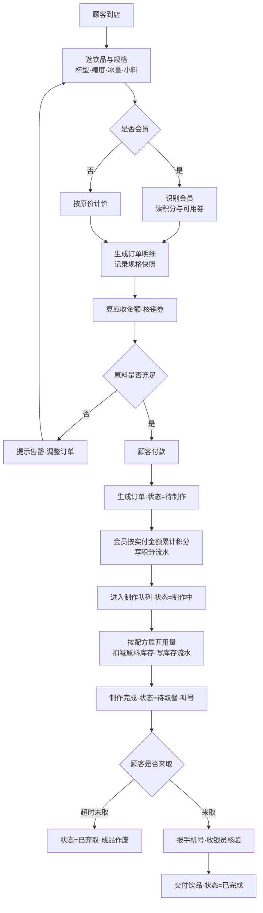

# v0.1 · 第一阶段提交快照

> **提交节点**：第 5 周周二 23:59　　**分值**：10
> **评分要点（课程原文）**：**建库完整性，不同角色约束与权限**
> **第一阶段暂不展示** —— 课堂展示安排在第 10 / 14 / 17 周，本次只需交材料。
>
> ⚠️ **归档规则**：提交前从 `project/` 与 `weeks/` 复制快照，**截止后本目录不再修改**。
> **唯一例外是 `result/`** —— 截图与运行记录是提交物本体，无法"从别处复制"。详见 [`../README.md`](../README.md)。

**依据**：[`course/lecture-week04.md`](../../../course/lecture-week04.md) 的「阶段作业：可运行的数据库原型（v0.1）」一节。

> **本文件按课程对该项的要求组织**：**项目范围 → 业务角色 → 业务流程 → 脚本执行顺序与复现步骤**，
> 之后是提交清单与目录说明。**内容自足** —— 只拿到本目录也能看懂整个项目。

---

## 一、项目范围

以**一家奶茶店**为经营场景，把业务转化为一个可运行的关系数据库。

| 项 | 设定 |
|---|---|
| 门店数量 | **1 家**（单店，不做连锁） |
| 菜单规模 | 30 款成品 |
| 原料规模 | 60 种 |
| 营业模式 | 堂食 + 自提（**不接**外卖平台） |
| 覆盖对象 | 课程要求的 6 类：**商品、库存、订单、订单明细、会员、员工** |
| 版本 | **v0.1**（第 1—4 周，数据库初建 + CRUD + 查询 / 视图 / 约束 / 授权） |

### 本场景的结构特征

```
商品（成品）──配方(BOM)──> 原料库存
卖一杯珍珠奶茶 = 珍珠 −20g + 红茶 −5g + 奶精 −15g + 糖浆 −10ml + 杯子 −1
```

**「商品 ↔ 库存之间隔着配方」是本场景选型的核心理由** —— 这一层让数据模型天然多一个层次，
而不是"进货即卖出"的扁平结构。

### 数据边界：什么进库、什么不进库

| 进库（19 项） | 不进库（13 项） |
|---|---|
| 商品、规格选项、配方、小料、原料、库存流水 | 外卖平台订单、多门店 / 连锁、排班考勤明细 |
| 订单头 / 明细 / 加料、支付状态 | 供应商联系人 / 账期 / 银行账户 |
| 会员、积分流水、优惠券 | 生产日期 / 保质期（**已砍**） |
| 员工、采购单头 / 明细、供应商 | 库位 / 移库（**第 2 周改为单库反冲**） |
| …… | 在途量、成品废弃登记、日常损耗管理 |

> **两条判断原则**：
> ① **是否参与约束 / 高频读**（如流水类型、沽清标记必须进库）；
> ② **是否属派生数据**（如"成品可制作量"由配方推算 → **用视图算，不建表**）。
>
> 逐项理由见 [`weeks/week01/business-requirements.md`](../../week01/business-requirements.md) §4.1 / §4.2。

---

## 二、业务角色

**5 个角色**：4 个员工岗位 + 1 个会员。本场景**不设供应商角色**。

| # | 角色 | 核心职责 | 权限设计方向 |
|---|---|---|---|
| 1 | **店长** | 排班考勤；菜单定价 / 调价 / 优惠券；决定进什么货；配方维护；经营报表；账号权限 | 最高权限，可授权他人 |
| 2 | **收银员** | 点单接待；录入杯型/糖度/冰量/小料；识别会员；核销券；收款；**出餐核验并交付** | 订单与会员**可写**；菜单配方**只读**；**不可改价、不可手工打折** |
| 3 | **制作员** | 按配方制作；操作台备料；闭档退料 | 原料领用**可写**；**不可改订单金额** |
| 4 | **库管员** | 到货验收；办理入库；原料上架与库位；定期盘点 | 库存与流水**可写**；**不可删订单、不可改价** |
| 5 | **会员（顾客）** | 点单消费；累积积分；使用优惠券；查本人消费记录 | 仅**本人数据只读**，不可见他人 |

> **会员不是员工** —— 用会员号标识，不在 `tbl_employee` 里。
> 因此第 4 周只建了 **4 个数据库角色**（店长 / 收银员 / 制作员 / 库管员）。

### 三组刻意不重叠的职责分离

这是"**为什么分 5 个角色而不是 2 个**"的答案：

| # | 分离 | 理由 |
|---|---|---|
| 1 | **收银员 vs 店长** —— 收银员**不能改价、不能打折** | 价格改动必须留痕、必须有审批人 |
| 2 | **收银员 vs 制作员** —— 一个碰**金额线**，一个碰**物料线** | 两条线由不同岗位负责，便于事后追责 |
| 3 | **制作员 vs 库管员** —— 一个负责**往外拿**（领料出库），一个负责**往里收 + 数账**（入库 + 盘点） | 一人既管收又管发，账实不符时无法追责 |

> **第 4 周的落地**：这 5 个角色 → **4 个数据库角色** + **3 组越权负例**（全部被 `Error 229` 拦截）。
> 见 [`code/08-security/role.sql`](code/08-security/role.sql) 与 [`result/06-security/`](result/06-security/)。
> 第 3 组分离的实际方式（制作员**经视图**只读库存）与一处已知边界，见
> [`report.md`](report.md) §1.3.3。

---

## 三、业务流程

### 主流程：从顾客点单到取餐完成

**点单方式**：**扫码点单**（小程序自助）与**柜台点单**（收银员代录）并存。



**⭐ 三个关键环节（本项目的核心设计）**：

| 环节 | 做什么 |
|---|---|
| **第 7 步** | 按**配方**校验原料是否充足 |
| **第 12 步** | 按**配方**把"1 杯奶茶"展开成各原料用量 |
| **第 13 步** | **扣减原料库存 + 写库存流水**（反冲倒扣） |

> 这条「**订单 → 配方 → 原料出库**」链是把**成品销量**转换成**原料消耗**的桥梁。

> ⚠️ **手机号在全流程出现两次，作用完全不同**：
> **下单时报** → 认出会员（打折 + 积分）；**取餐时报** → **核验是本人**（把饮品给对人）。
> 取餐报手机号**不是为了加积分**（积分在下单支付后就已累计）。

### 订单状态机

```
待制作 ──> 制作中 ──> 待取餐 ──> 已完成
                        │
                        └──> 已弃取（超时未取，成品作废）

待制作 / 制作中 ──> 已取消（需回滚已扣原料与已计积分）
```

### 支撑流程

| # | 流程 | 落点 |
|---|---|---|
| 1 | **采购补货**（原料的"进"） | 采购单 + 明细 + 库存流水 |
| 2 | ~~开档备料与领用（仓库 ⇄ 操作台）~~ | ❌ **已作废** —— 第 2 周改为**单库反冲**，不存在领料 |
| 3 | **损耗与报损** | 库存流水（`LOSS` 类型） |
| 4 | 盘点 | ⏸ 延后至 v1.0 |
| 5 | **会员生命周期** | 会员 + 积分流水 + 优惠券 |
| 6 | **菜单与配方管理** | 商品（成品）+ 配方（BOM） |

> 逐环节的 17 步对照表与细节见 [`weeks/week01/business-requirements.md`](../../week01/business-requirements.md) §三。

---

## 四、脚本执行顺序与复现步骤

**前置环境**：SQL Server 2022 Express，实例 `.\SQLEXPRESS`，Windows 集成认证。

```powershell
cd project\sql
sqlcmd -S .\SQLEXPRESS -E -C -f 65001 -i 99-rebuild.sql
```

**一条命令从空库重建全部**：

```
17 张表 / 132 字段 / 30 外键 / 43 CHECK / 17 候选码 / 21 索引
20,979 行种子数据 / 5 个统计视图 / 4 个安全角色
实测 15—17 秒
```

| 脚本 | 作用 | 是否在 `99-rebuild` 内 |
|---|---|---|
| `00-bootstrap/` | 建库（排序规则 / 兼容级别 / 恢复模式） | ✅ 自动 |
| `01-schema/` | 建表（17 张 / 132 字段） | ✅ 自动 |
| `02-constraints/` | 候选码 / CHECK / 外键 | ✅ 自动 |
| `03-indexes/` | 索引（21 个） | ✅ 自动 |
| `04-seed/` | 种子数据（20,979 行） | ✅ 自动 |
| `07-view/` | 5 个统计视图 | ✅ 自动 |
| `08-security/` | 4 岗位 RBAC | ✅ 自动 |
| `05-dml/` | CRUD 演示（含 5 个负例） | 📄 **按需单独执行** |
| `06-query/` | 4 组多表查询 | 📄 **按需单独执行** |

> `05` 与 `06` 会写入 `DEMO-` 前缀的演示数据，且 `05` 自带清理与回滚，
> **不属于"重建出干净数据库"的范畴**，故不接入一键重建。
>
> ⚠️ **必须在 `project\sql` 目录下执行** —— sqlcmd 的 `:r` 相对**当前工作目录**解析。
> ⚠️ **含中文的 `.sql` 必须存为 UTF-8 带 BOM**，否则 sqlcmd 会**静默失效**（无报错但一行都不生效）。

---

## 五、提交清单（6 项）

| # | 提交物 | 课程要求 | 本目录落点 | 状态 |
|---|---|---|---|---|
| 1 | **README** | 项目范围、业务角色、业务流程、**脚本执行顺序与复现步骤** | **本文件**（四节齐全，内容自足） | ✅ |
| 2 | **sql 目录** | 建库 / 样例数据 / CRUD / 查询视图 / 约束与角色 —— 五类，**含前几周要求** | **`code/`**（`project/sql/` 快照，**11 个文件 / 2.02 MB**） | ✅ |
| 3 | ⭐ **结果目录** | 成功建库 · 正常 · 非法 · 越权 · 关键查询 · CRUD · 统计视图 · 角色权限 **的截图** | **`result/`** —— 清单见 [`result/README.md`](result/README.md) | ✅ **36 张** |
| 4 | **阶段报告** | 设计思路、实验过程、实验总结 | [`report.md`](report.md)（499 行） | ✅ |
| 5 | **`ai_log`** | 记录 AI 建议、人工修改及验证结论 | [`ai-log.md`](ai-log.md)（373 行） | ✅ ⚠️ 提示词留存有缺口，见其 §5 |
| 6 | **组内分工** | 小组成员分工与贡献 | [`contributions.md`](contributions.md)（136 行） | ✅ ⏳ 工时列待双方填写 |

---

## 六、目录结构

```
v0.1/
├─ README.md              # 本文件 —— 课程要求的四项 + 提交清单
├─ code/                  # ② project/sql/ 的提交时快照（11 个文件 / 2.02 MB）
├─ result/                # ③ 36 张证据图 + 36 份原始输出
│  ├─ README.md           #    截图索引（每张图对应哪条命令、预期结果）
│  ├─ 01-build/           #    成功建库 + 可复现验证
│  ├─ 02-crud/            #    增删改查（正常）+ 执行前后
│  ├─ 03-invalid/         #    非法数据被拒绝（5 个负例 + 汇总）
│  ├─ 04-query/           #    Q1—Q4 关键查询
│  ├─ 05-view/            #    5 个统计视图
│  └─ 06-security/        #    赋权矩阵 + 角色绑定 + 3 组越权
├─ report.md              # ④ 阶段报告
├─ ai-log.md              # ⑤ AI 使用记录（课程叫 ai_log）
└─ contributions.md       # ⑥ 组内分工表
```

> **关于 `result/` 的截图**：这些图由 `result/render.ps1` **把 sqlcmd 的真实运行输出渲染而成**，
> **不是图形客户端的界面截屏**。理由与验证方式见 [`result/README.md`](result/README.md) 开头的说明。

---

## 七、阶段报告的重点（课程原文第 27—30 行）

> 重点应该说明：
> 1. 经营场景与业务流程，**哪些信息进入数据库、哪些暂不进入，为什么**
> 2. **表是如何设计的，主码、候选码、外码如何设置及理由**
> 3. **完整性约束：角色与权限如何划分，给出正反例**

| # | 重点 | 在 `report.md` 的落点 | 也可参见 |
|---|---|---|---|
| 1 | 场景与数据边界 | §1.1、§1.2 | 本文件 **§一** |
| 2 | 表 / 主码 / 候选码 / 外码的设计与理由 | §1.4 | `code/01-schema`、`code/02-constraints` |
| 3 | **角色与权限的划分 + 正反例** | §1.3.3、§2.4.4 | 本文件 **§二**、`code/08-security/role.sql` |
