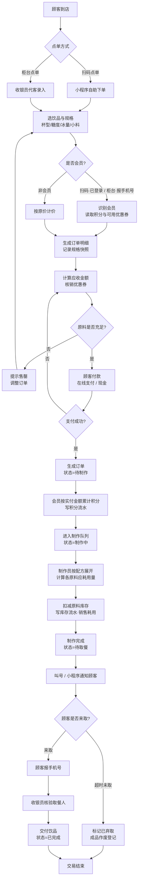
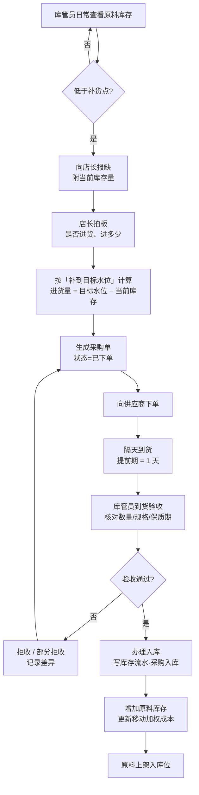
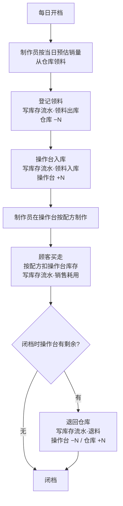
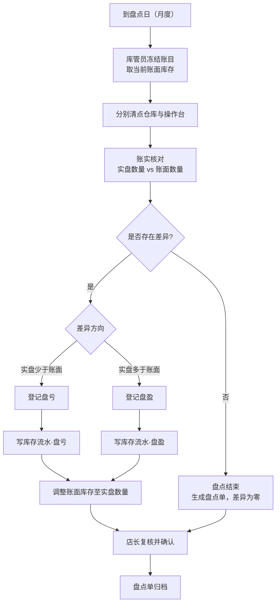
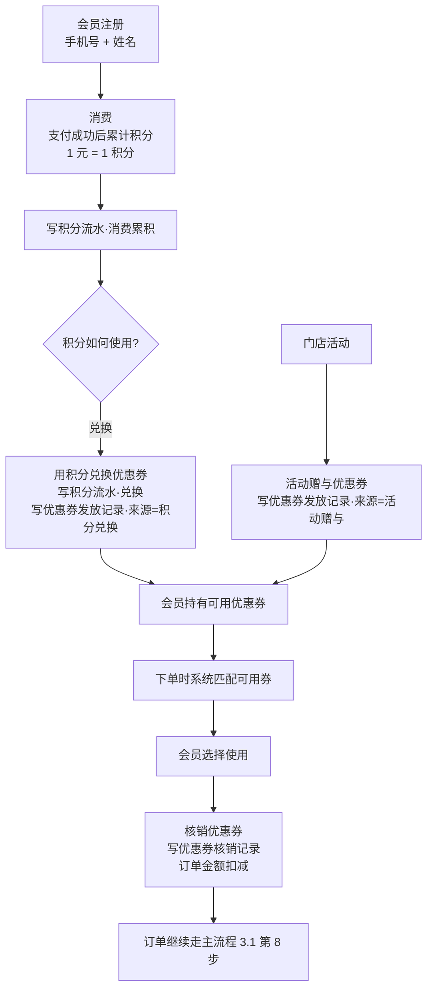
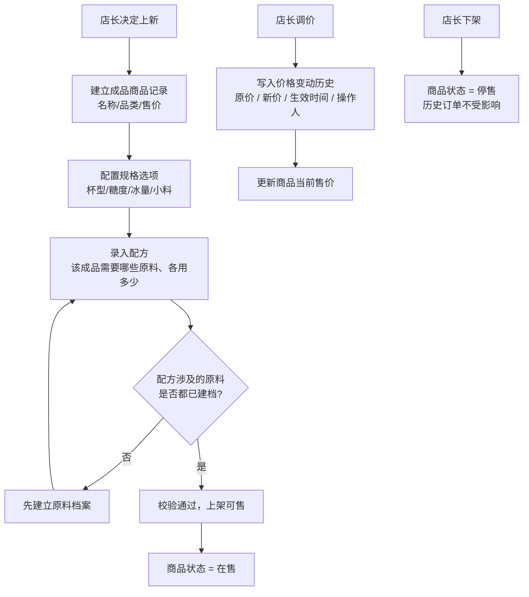

# 第一周报告 · 数据库系统概述与业务需求分析

**项目**：奶茶店经营数据库
**阶段**：第一阶段（第 1—4 周）· 版本目标 v0.1
**本周定位**：把一个真实经营场景转化为数据库任务 —— 确定边界、角色、业务流程
**本周不做**：不写 SQL、不建表

---

## 〇、本周决策记录

| 决策项 | 结论 | 依据 |
|---|---|---|
| 经营场景 | **奶茶店（单店）** | 本学期不得更换 |
| 选择理由 | **结构完备**：商品 ↔ 库存之间隔着**配方（BOM）**，天然多一个层次，订单也有"点单→制作→取餐"的状态流转 | 见 `数据可得性对比表.md` |
| 数据策略 | **路线 B：母本 + 自建** | ⚠️ 由"真实CSV直导"改为本策略，原因见下 |
| 复杂度控制 | 原料 ≤ 60 种、菜单 ≤ 30 款、规格选项固定枚举、不做外卖平台对接、不做多门店 | 见第四节 4.4 |

> ### ⚠️ 重要变更说明
>
> 上一轮我们按"**数据现成优先**"选过小卖部。现改选奶茶店，**连带放弃了"数据现成"这条路**——因为经调研，**公开数据中不存在任何一家单店奶茶店的库存/进货记录**（详见 `数据可得性对比表.md`）。
>
> 这不是问题，但必须明确：**本项目的库存、配方、会员、员工数据将由我们按业务规则自建**，公开数据只承担两个角色：
> 1. **销量分布的母本**（用来让生成的销量贴近真实茶饮店的量级与季节性）
> 2. **结构范本**（Lokad 数据集的 `BOM` 表正好就是"配方"的现成建模方式）
>
> 我们换来的东西是：**一个多层次的、更接近真实的数据库结构**——这正是选奶茶店的理由。

---

## 一、经营场景设定

### 1.1 店铺画像

| 项 | 设定 |
|---|---|
| 店名 | 茶颜小铺 |
| 定位 | 校园 / 商圈临街茶饮店 |
| 营业时间 | 10:00 — 22:00，全年无休 |
| 门店数量 | **1 家（单店）** |
| 收银台 | 1 个点单台 + 1 个取餐台 |
| 菜单规模 | 约 **30 款成品**（经典奶茶 / 水果茶 / 纯茶 / 季节限定） |
| 原料规模 | 约 **60 种**（茶叶、奶基底、糖浆、小料、杯具、包材） |
| 日均订单 | 约 200—400 单 |
| 客单价 | 12—20 元 |

### 1.2 奶茶店的核心结构特征（选它的理由）

这是本项目与小卖部最本质的区别，也是答辩时必须讲清楚的一点：

```
小卖部：  商品 ──1:1── 库存        （卖一包薯片，库存减 1）

奶茶店：  商品 ──配方(BOM)── 原料库存
          卖一杯珍珠奶茶
            = 珍珠 −20g
            + 红茶 −5g
            + 奶精 −15g
            + 糖浆 −10ml
            + 杯子 −1个
            + 吸管 −1根
```

**由此产生两个层次的"库存"概念**（本项目的设计要点）：

| 层次 | 含义 | 是否建物理表 |
|---|---|---|
| **原料库存** | 茶叶、珍珠、糖浆等真实存放的物料数量 | ✅ **建表**（这是真库存） |
| **成品可制作量** | 由当前原料库存 ÷ 配方，推算"还能做几杯某饮品" | ❌ **不建表，用视图算** |

> 第二层是**派生数据**，按第一周定的边界原则（第四节 4.3 第 3 条）一律不做物理表。这一条会在第二阶段的视图设计里直接复用。

### 1.3 人员编制

| 岗位 | 人数 | 说明 |
|---|---|---|
| 店长 | 1 | 全店负责，兼采购决策与排班 |
| 收银员 | 1 | 点单接待、收款 |
| **制作员** | **2** | 按配方制作、领料登记、闭档退料 |
| 库管员 | 1 | 收货、入库、盘点 |
| **合计** | **5** | 除制作员外均为暂定 1 人 |

> **库管员与店长为两个独立角色**（不合并）—— 以便第 3、4 阶段做职责分离与授权实验。

### 1.4 会员体系

> 由小组确定：会员**只做两件事 —— 积分与优惠券**。
> **不设储值，也不设等级折扣。**

| 项 | 规则 |
|---|---|
| **注册** | 手机号 + 姓名；扫码点单时在小程序内注册/登录，柜台点单时由收银员登记 |
| **积分** | 消费 1 元累计 1 积分；**积分用于兑换优惠券** |
| **优惠券** | **两个来源：积分兑换 / 活动赠与**；下单时自动匹配可用券，由顾客选择核销 |

> ⚠️ **本店没有「等级折扣」。** 会员能少付钱，**只通过优惠券实现**。
> 这一点在建表时很关键：**不需要"会员等级规则"表**，只需要"优惠券"与"积分流水"两张。

---

## 二、经营角色与职能清单

> 本清单由小组确定：**4 个员工岗位 + 1 个会员角色，共 5 个**。
> 本场景**不设供应商角色**，理由与影响见第 2.4 节。

### 2.1 角色总表

| # | 角色 | 是否员工 | 核心职责 | 涉及的主要数据 | 后续权限设计方向 |
|---|---|---|---|---|---|
| 1 | **店长** | 是 | 排班与考勤；菜单定价、调价、优惠券设置；决定进什么货、进多少；配方维护；查看经营报表；分配账号权限 | 全部业务表 + 统计视图 | 最高权限，可授权他人 |
| 2 | **收银员** | 是 | 柜台点单接待；录入杯型/糖度/冰量/小料等规格；识别会员；核销优惠券；收款；**出餐核验并交付饮品** | 订单、订单明细、支付、会员、积分流水、优惠券、菜单与配方（只读） | 订单与会员**可写**；菜单与配方**只读**；**不可改价、不可手工打折** |
| 3 | **制作员** | 是 | 按配方制作；领料登记（仓库→操作台）；操作台备料与闭档退料 | 配方（只读）、原料库存（领料可写）、订单（只读查看待制作） | 原料领用**可写**；**不可改订单金额** |
| 4 | **库管员** | 是 | 到货验收；办理入库；原料上架与库位管理；定期盘点 | 原料库存、库存流水、采购单（只读） | 库存与库存流水**可写**；**不可删订单、不可改价** |
| 5 | **会员（顾客）** | 否 | 点单消费；累积积分；使用优惠券；查询本人消费记录 | 仅**本人**的订单、积分流水、优惠券 | 仅**本人数据只读**，不可见他人数据 |

### 2.2 三组职责分离（第 3、4 阶段权限实验的素材）

角色不是随便分的，三处**刻意不重叠**：

| # | 分离 | 依据 |
|---|---|---|
| 1 | **收银员 vs 店长**——收银员**不能改价、不能打折**，改价与折扣权归店长 | 价格改动必须留痕、必须有审批人；这是"价格变动历史"表存在的理由 |
| 2 | **收银员 vs 制作员**——收银员碰**订单与金额**；制作员碰**配方与物料** | 两人负责不同的数据域。金额与物料分属两条线，由不同岗位各自负责，便于事后追责 |
| 3 | **制作员 vs 库管员**——制作员负责**往外拿**（领料出库）；库管员负责**往里收 + 数账**（入库 + 盘点） | 一人既管收又管发，账实不符时无法追责 |

> **答辩要点**：这三组分离是"为什么要分 5 个角色而不是 2 个"的答案。若只分"店长/店员/会员"，上面三条全都无法表达，第 3、4 阶段的授权实验也就没有素材。

> ### ⚠️ 记录一条被否决的假设：配方不是机密
>
> 初稿曾假设"**配方是商业机密，收银员不可见配方用量**"，并以此作为第 2 组分离的理由。
> **小组澄清：本店配方任何人都能看。**
>
> 因此该假设作废，相应地：
> - 第 2 组分离的**理由改写**为"数据域不同"（金额线 vs 物料线），**不再以保密为理由**
> - §2.3 矩阵中，收银员对「配方维护」由 `✘` 改为 `👁 只读`
>
> **保留这条记录的原因**：答辩时能说明"我们假设过保密需求，经小组核对后修正"——**这体现了设计经过真实讨论，而非照搬模板**。

### 2.3 角色与业务的对应关系

| 业务动作 | 店长 | 收银员 | 制作员 | 库管员 | 会员 |
|---|:--:|:--:|:--:|:--:|:--:|
| 菜单定价 / 调价 / 优惠券设置 | ✅ | ✘ | ✘ | ✘ | ✘ |
| 配方维护 | ✅ | 👁 只读 | 👁 只读 | ✘ | ✘ |
| 点单 / 收银 | ✅ | ✅ | ✘ | ✘ | ✘ |
| 会员登记 / 积分 | ✅ | ✅ | ✘ | ✘ | 🟡 查询本人 |
| 按配方制作 | ✘ | ✘ | ✅ | ✘ | ✘ |
| 领料登记（仓库 → 操作台） | ✘ | ✘ | ✅ | 🟡 复核 | ✘ |
| 闭档退料 | ✘ | ✘ | ✅ | 🟡 复核 | ✘ |
| 决定进货（进什么 / 进多少） | ✅ | ✘ | ✘ | 🟡 报缺 | ✘ |
| 收货验收 / 入库 | ✘ | ✘ | ✘ | ✅ | ✘ |
| 盘点 | ✅ 复核 | ✘ | ✘ | ✅ | ✘ |
| 查看经营报表 | ✅ | ✘ | ✘ | ✘ | ✘ |
| 账号与权限管理 | ✅ | ✘ | ✘ | ✘ | ✘ |

> 图例：✅ 可执行　👁 只读　🟡 部分 / 需申请　✘ 不可
>
> **注**：原「成品废弃登记」一行已删除——小组决定不做日常损耗管理（见 §3.5）。

### 2.4 关于「供应商」

**定案：建 `tbl_supplier`（4 字段极简表），并在 `tbl_purchase_order` 上加 `supplier_id` 外码。**

「向供应商下单」是**业务流程中的动作**（见 §3.3）；「供应商」是**数据实体** —— 两者分开判断。

| 方案 | 做法 | 结论 |
|---|---|---|
| 甲 | 完全不记 | ✘ 不采用 |
| 乙 | 记成文本字段 | ✘ 不采用 —— 文本无法作外键，`'晨光乳业'` / `'晨光'` 会变成两个供应商 |
| **丙** | **建独立的供应商表** | ✅ **采用** |

> **为什么不选甲**：第 4 周需要「**供应商 → 采购单 → 采购明细 → 原料**」这条**四层级联** JOIN 素材；
> 且答辩时"货是谁送来的"是可能被追问的点。代价极小（1 张 4 字段表 + 1 个外码）。
>
> **边界（明确不记）**：联系人、账期、银行账户 —— 见 §4.2 #6。
>
> 📌 本节最初按"简化"定为方案甲，**第 2 周修订为方案丙**（登记在
> [`issue-review.md`](../week02/issue-review.md) 修正汇总第 16 条）。

> **决策（第 5 项，小组确认）：** 采购补货流程照常进行（仍会向供货方下单），但**数据库不记录"货从谁那里来"**。
>
> **代价**：无法做供应商维度的统计与对账（如"哪家茶叶的到货准时率"）。
> **理由**：符合本场景"不要太复杂"的定位，且供应商不是课程要求的 6 类核心对象之一。
>
> **注意区分**：「向供应商下单」是**业务流程中的动作**（见 §3.3），「供应商」是**数据实体**——本决策只否掉后者。

### 2.5 数据库账号 ↔ 员工岗位（第 3、4 阶段用）

```
店长    ──> 员工工号 E001 ──> 数据库账号 mgr_01
收银员  ──> 员工工号 E002 ──> 账号 cashier_01
制作员  ──> 员工工号 E003 / E004 ──> 账号 maker_01 / maker_02
库管员  ──> 员工工号 E005 ──> 账号 stock_01
```

> 全店共 5 名员工。**会员不走员工工号体系**——它是顾客，用会员号标识，不是员工表中的记录。
> 这一区分在第 2 阶段建表时决定了它属于独立实体。

---

## 三、业务流程

### 3.1 主流程：从顾客点单到取餐完成

这是本周作业要求的核心链路（"覆盖从顾客到完成交易的主要环节"）。

**本店的点单方式为「扫码点单 + 柜台点单」两种并存。**



**文字步骤说明：**

| 步 | 动作 | 涉及的数据 |
|---|---|---|
| 1 | 顾客到店，选择点单方式 | — |
| 2 | **扫码点单**：小程序自助下单；**柜台点单**：收银员代客录入 | — |
| 3 | 选饮品与规格：杯型（中/大）、糖度（无糖/三分/五分/七分/全糖）、冰量（去冰/少冰/正常/热）、小料（珍珠/椰果/布丁/芋圆） | 商品表、规格选项表 |
| 4 | **识别会员**：扫码点单由小程序登录自动识别；柜台点单由顾客报手机号 | 会员表 |
| 5 | 生成订单明细行，**记录规格快照** | 订单明细 |
| 6 | 计算应收金额，核销顾客选用的优惠券 | 优惠券 |
| 7 | **按配方校验原料是否充足**（珍珠够不够、杯子够不够） | 配方表、原料库存 |
| 8 | 顾客付款（在线支付 / 现金） | 支付记录 |
| 9 | 支付成功后生成订单，**状态 = 待制作** | 订单 |
| 10 | 若为会员，按**实付金额**累计积分，写积分流水 | 积分流水 |
| 11 | 订单进入制作队列，**状态 = 制作中** | 订单 |
| 12 | 制作员按**配方**把"1 杯珍珠奶茶"展开成各原料应耗用量 | 配方表 |
| 13 | 扣减原料库存，写库存流水（类型 = 销售耗用） | 原料库存、库存流水 |
| 14 | 制作完成，**状态 = 待取餐**；叫号 / 小程序通知顾客 | 订单 |
| 15 | 顾客到取餐台，**报手机号** | — |
| 16 | **收银员核验取餐人**，交付饮品，**状态 = 已完成** | 订单 |
| 17 | 若超时未取：**标记已弃取**，成品作废 | 订单（状态） |

> **⚠️ 注意：手机号在全流程出现两次，作用完全不同** ——
>
> | 环节 | 何时 | 作用 |
> |---|---|---|
> | 第 4 步 | **下单时** | 认出会员 → **打折 + 积分** |
> | 第 15 步 | **取餐时** | **核验是本人** → 把饮品给对人 |
>
> 这一点容易被混淆。取餐时报手机号**不是为了加积分**（积分在下单支付后就已累计），而是**出餐核验**。

> **可解释要点（答辩重点）**：
> - **第 7、12、13 步是本项目的灵魂**——"订单 → 配方 → 原料出库"这条链，是把成品销量转换成原料消耗的桥梁。这也是第三阶段**触发器**最好的素材（插入订单 → 自动按配方扣料）。
> - **第 9—17 步的订单状态流转**，让订单有生命周期，第三阶段的**事务**实验有了自然边界。
> - **第 10 步**：积分在支付后累计。若订单之后被取消或退单，**需要回冲积分**——这是又一个触发器/事务素材。

### 3.2 订单状态机

```
待制作 ──> 制作中 ──> 待取餐 ──> 已完成
                        │
                        └──> 已弃取（超时未取，成品作废）

待制作 / 制作中 ──> 已取消（需回滚已扣原料与已计积分）
```

| 状态 | 含义 | 触发 |
|---|---|---|
| 待制作 | 已付款，等待制作 | 支付成功 |
| 制作中 | 制作员已接单 | 进入制作队列 |
| 待取餐 | 已做好，等待顾客 | 制作完成 |
| 已完成 | 已交付顾客 | 收银员核验交付 |
| 已弃取 | 超时未取，成品作废 | 超时标记 |
| 已取消 | 订单作废 | 退单 |

> **"已取消"要回滚已扣原料与已计积分**——这是第三阶段事务回滚实验的天然场景。

---

> ✅ **支撑流程（3.3—3.8）已与小组逐条核对确认。**
> 每节均标注了「已确认的规则」与来源；被否决的设计另见 §2.2、§3.5 的记录。

### 3.3 支撑流程一：采购补货（原料的"进"）✅

**已确认的规则：**

| 项 | 规则 | 来源 |
|---|---|---|
| 谁发现缺货 | **库管员**（日常查看库存） | 小组确认 |
| 谁拍板进货 | **店长**（库管员报缺 → 店长决定进不进、进多少） | 小组确认 |
| 进货量怎么算 | **补到目标水位**：`进货量 = 目标水位 − 当前库存` | 小组确认 |
| 到货时间 | **隔天到**，即**提前期 = 1 天** | 小组确认 |



**文字步骤说明：**

| 步 | 动作 | 角色 | 涉及的数据 |
|---|---|---|---|
| 1 | 库管员日常查看原料库存 | 库管员 | 原料库存 |
| 2 | 低于补货点 → 向店长报缺，附当前库存量 | 库管员 | 原料库存、补货点 |
| 3 | **店长拍板**是否进货、进多少 | 店长 | — |
| 4 | 按「补到目标水位」算出进货量 | 店长 | 目标水位、当前库存 |
| 5 | 生成采购单（状态 = 已下单） | 店长 | 采购单、采购明细 |
| 6 | 向供应商下单，**隔天到货** | — | 提前期 = 1 天 |
| 7 | 到货验收：核对数量、规格、保质期 | 库管员 | 采购单 |
| 8 | 验收不通过 → 拒收 / 部分拒收，记录差异 | 库管员 | 采购单状态 |
| 9 | 验收通过 → 办理入库，写库存流水（采购入库） | 库管员 | 库存流水 |
| 10 | 增加原料库存，更新移动加权成本 | — | 原料库存、批次成本 |
| 11 | 原料上架入库位 | 库管员 | 库位 |

> **数据库含义**：本流程确定了两张表必须存在——**「采购单」**与**「原料库存」**，且原料库存要带两个字段：**补货点**与**目标水位**。

> **🔗 第四阶段的接口**：`进货量 = 目标水位 − 当前库存` 里的"目标水位"，就是第四阶段**线性回归预测销量**之后要重新计算的量。预测值越大 → 目标水位越高 → 进货量越大。**这条公式是整个"预测驱动补货"的落点。**

> **⏳ 待定的细节**：提前期为 1 天，意味着**下单后到到货前存在「在途量」**。若此期间再次判断库存，是否需要把在途量算进去（`进货量 = 目标水位 − 当前库存 − 在途量`）？本项目**暂按不考虑在途量**处理，后续如需精度再议。

### 3.4 支撑流程二：开档备料与领用（仓库 ⇄ 操作台）✅

**已确认的规则：**

| 项 | 规则 | 来源 |
|---|---|---|
| 原料存放 | 集中在**仓库**；操作台另设一个**库位** | 小组确认 |
| 领用登记 | **要登记**（暂定） | 小组确认 |
| 领料性质 | **移库**，不是消耗——仓库减、操作台加，**总数不变** | 小组确认 |
| 真正扣减 | 由**顾客买走时按配方扣**（即 3.1 第 13 步的"销售耗用"） | 小组确认 |
| 领料频率 | **按天**领一次（默认，可改） | 待确认 |



**文字步骤说明：**

| 步 | 动作 | 角色 | 库存变化 |
|---|---|---|---|
| 1 | 每日开档，制作员按当日预估销量从仓库领料 | 制作员 | — |
| 2 | 登记领料，写库存流水（领料出库） | 制作员 | 仓库 **−N** |
| 3 | 原料进入操作台库位，写库存流水（领料入库） | 制作员 | 操作台 **+N** |
| 4 | 在操作台按配方制作饮品 | 制作员 | — |
| 5 | 顾客买走，**按配方扣操作台库存**（3.1 第 13 步） | 系统 | 操作台 **−N** |
| 6 | 闭档，操作台未用完的原料退回仓库 | 制作员 | 操作台 −N / 仓库 +N |

> ### 🔑 本流程的核心：库存是**两层**的
>
> ```
> 总库存 = 仓库库存 + 操作台库存
> ```
>
> | 动作 | 仓库 | 操作台 | 总数 |
> |---|:--:|:--:|:--:|
> | 采购入库 | +N | — | **+N** |
> | 领料（移库） | −N | +N | **不变** |
> | 销售耗用（按配方） | — | −N | **−N** |
> | 退料（移库） | +N | −N | **不变** |
> | 盘盈亏 | 视库位而定 | 视库位而定 | **±N** |
>
> **只有三种动作会改变总数**：采购入库（+）、销售耗用（−）、盘盈亏（±）。
> **移库类动作（领料、退料）永远不改变总数**——这是对账时的主要检查点。

> **可解释要点（答辩重点）**：
> - **本流程是"库存只由业务依据驱动"的实现**——顾客每买走一杯，操作台就按配方少一份料。制作员"今天领了多少"**不影响**库存总数，只是把料从仓库挪到操作台。
> - 这样做的收益：**库存的每一次减少都能追溯到具体订单**。若改成"领料即出库"，领了没用完的部分就会变成无据可查的账面差异。
> - 代价：多一个库位维度，第 2 阶段建表时库存表的主码是**（原料, 库位）**而不是单一原料。

> **数据库含义**：
> 1. 「原料库存」表需要**库位**维度 → 主码为 **(原料, 库位)**
> 2. 「库存流水」表的类型至少要有：**采购入库 / 领料出库 / 领料入库 / 退料 / 销售耗用 / 盘盈亏**（不含报损，见 §3.5）
> 3. **移库要写两行**（一出一进），或设计成带"源库位/目标库位"的单行——第 2 阶段定表结构时决定

### 3.5 支撑流程三：损耗与报损 ⚠️ 大幅裁剪

**小组决定：本场景不做日常损耗管理。**

| 原设想 | 结论 | 理由 |
|---|---|---|
| 成品时效报废（珍珠 4 小时、茶汤 4 小时） | ❌ **砍掉** | 小组决定"每天的就不要了" |
| 原料过期报损 | ❌ **砍掉** | 小组决定"暂定原料不会过期" |
| 顾客超时未取 → 成品作废 | ✅ **保留** | 但不是独立流程，**已并入主流程 3.1 第 17 步** |

> ### 这是一条「记录被否决方案」的条目
>
> 上文两条报废规则**曾进入设计草案，后被小组否决**。保留在此，是为了在答辩时能说明"**我们考虑过损耗管理，出于简化考虑主动放弃**"——这与"没想到"是两回事。
>
> **对库存的影响**：「库存流水」将**不含"报损"类型**。库存总数的变化只剩三种来源：
>
> | 动作 | 对总数 |
> |---|---|
> | 采购入库 | **+N** |
> | 销售耗用（按配方） | **−N** |
> | 盘盈亏 | **±N** |
>
> 台账平衡式相应简化为：
> ```
> 期初 + Σ采购入库 − Σ销售耗用 ± Σ盘盈亏 = 期末
> ```

> **⚠️ 一个尚未决定的小口子**：**打翻、破损**这类物理损耗要不要留一档？
> - 留 → 库存流水多一种类型，报损登记有人负责
> - 不留 → 所有账实不符一律走「盘盈亏」
>
> 默认按**不留**处理（进一步简化）。若后续觉得需要，再补。

### 3.6 支撑流程四：盘点 ✅

**已确认的规则：**

| 项 | 规则 | 来源 |
|---|---|---|
| 是否盘点 | **盘** | 小组确认 |
| 频率 | **月度**（"不用太频繁"；暂定一月一次） | 小组确认 |
| 执行人 | **库管员**（店长复核） | §2.2 矩阵 |
| 盘点范围 | **按库位分别盘**：仓库、操作台各盘一次 | 由 §3.4 的两层库存推出 |



**文字步骤说明：**

| 步 | 动作 | 角色 | 涉及的数据 |
|---|---|---|---|
| 1 | 到盘点日（月度），冻结账目，取当前账面库存 | 库管员 | 原料库存 |
| 2 | 分别清点**仓库**与**操作台** | 库管员 | — |
| 3 | 账实核对：实盘数量 vs 账面数量 | 库管员 | 原料库存 |
| 4 | 有差异 → 按方向登记**盘亏**（实盘少）或**盘盈**（实盘多） | 库管员 | 盘点单 |
| 5 | 写库存流水（盘亏 / 盘盈） | 库管员 | 库存流水 |
| 6 | 调整账面库存至实盘数量 | 库管员 | 原料库存 |
| 7 | 店长复核并确认 | 店长 | 盘点单 |
| 8 | 盘点单归档 | — | 盘点单 |

> **为什么盘点必须保留**：砍掉它，台账就变成 `期初 + 采购 − 销售 = 期末` 的**恒等式**——意味着**现实中的所有差错都无处安放**（打翻、记错、少记、多记）。保留盘点，台账才有"发现并纠正差异"的出口，这也是把库存流水做成**可审计**的关键。
>
> **答辩要点**：**盘亏 / 盘盈是库存总数仅有的三种变化来源之一**（另两个是采购入库与销售耗用）。另两类都是**有单据依据的正常流动**，只有盘盈亏是**对账差异的修正**——它存在本身，就说明我们承认"账面和现实会有出入"。
>
> **数据库含义**：第 2 阶段需要「**盘点单**」与「**盘点明细**」两张表，明细上要有 `账面数`、`实盘数`、`差异` 三个字段。

### 3.7 支撑流程五：会员生命周期 ✅

**已确认的规则：**

| 项 | 规则 | 来源 |
|---|---|---|
| 注册 | 手机号 + 姓名；小程序自助注册，或柜台由收银员登记 | §1.4 |
| 积分获取 | 消费 1 元累计 1 积分（支付后即累计） | 小组确认 |
| **积分用途** | **兑换优惠券** | 小组确认 |
| **优惠券来源** | ① **积分兑换**　② **活动赠与** | 小组确认 |



**文字步骤说明：**

| 步 | 动作 | 涉及的数据 |
|---|---|---|
| 1 | 会员注册：手机号 + 姓名（小程序自助 / 柜台收银员登记） | 会员档案 |
| 2 | 消费支付成功后，按**实付金额**累计积分（1 元 = 1 积分） | 积分流水（类型 = 消费累积） |
| 3 | **积分兑换优惠券**：扣减积分，发放一张券 | 积分流水（类型 = 兑换）、优惠券发放记录 |
| 4 | **活动赠与优惠券**：门店做活动时直接发券（不扣积分） | 优惠券发放记录（来源 = 活动赠与） |
| 5 | 下单时系统匹配该会员的可用券 | 优惠券发放记录、有效期 |
| 6 | 会员选择使用某张券 → 核销，订单金额扣减 | 优惠券核销记录、订单 |
| 7 | 订单继续走主流程（3.1 第 8 步付款） | — |

> **🔑 设计要点：优惠券必须有两个来源字段**
>
> | 来源 | 是否消耗积分 | 举例 |
> |---|---|---|
> | **积分兑换** | ✅ 消耗 | 500 积分 → 5 元券 |
> | **活动赠与** | ❌ 不消耗 | 开业活动送 5 元券 |
>
> 两者都要落到**同一张「优惠券发放记录」**里，用一个"来源"字段区分。
> **为什么不能分成两张表**：对会员而言都是"我有一张券"，核销逻辑完全相同；只是"怎么来的"不同。用来源字段区分，核销时不必关心来路。

> **积分流水的两种类型**（必须都能追溯）：
> - **消费累积**（+）—— 关联到具体订单
> - **兑换**（−）—— 关联到换出的那张券

> **数据库含义**：第 2 阶段需要三张表 ——「**会员档案**」「**积分流水**」「**优惠券**（发放 + 核销）」。
> 积分**只存余额会丢失去向**，必须流水化；优惠券**只存状态会丢失来路**，必须有发放记录。

### 3.8 支撑流程六：菜单与配方管理 ✅

**已确认的规则：**

| 项 | 规则 | 来源 |
|---|---|---|
| 维护人 | **店长**（菜单与配方均由店长维护） | 小组确认 |
| 配方可见性 | **任何人都能看**，不设保密 | 小组确认 |



**文字步骤说明：**

| 步 | 动作 | 角色 | 涉及的数据 |
|---|---|---|---|
| 1 | 决定上新，建立成品商品记录（名称、品类、售价） | 店长 | 商品 |
| 2 | 配置规格选项（杯型 / 糖度 / 冰量 / 小料） | 店长 | 规格选项 |
| 3 | **录入配方**：该成品需要哪些原料、各用多少 | 店长 | 配方（BOM） |
| 4 | 校验：配方涉及的原料是否都已建档；未建档则先补原料档案 | 店长 | 配方、原料 |
| 5 | 上架，商品状态 = 在售 | 店长 | 商品 |
| 6 | 调价时写入**价格变动历史**（原价、新价、生效时间、操作人） | 店长 | 价格变动历史 |
| 7 | 下架时商品状态 = 停售，**历史订单不受影响** | 店长 | 商品 |

> **为什么调价必须留痕**：订单明细里虽然存了**成交单价快照**，但只有快照无法回答"**这个价格是谁在什么时候改的、为什么改**"。价格变动历史补上的是**变更的审计轨迹**，与订单明细的快照是两件事，缺一不可。

> **关于配方可见性**：本店配方**公开**，任何岗位都能查看（见 §2.2 的说明）。因此第 3、4 阶段做权限时，**不需要为配方设置特殊的访问控制**——只需限制"谁能**改**"（仅店长），而"谁能看"是全员开放。

> **数据库含义**：第 2 阶段需要 ——「商品」「规格选项」「**配方**」「**价格变动历史**」四张表。
> 配方表的结构是 **成品 × 原料 × 用量**，正是把订单销量转换成原料消耗的桥梁（对应主流程 3.1 第 12 步）。

---

## 四、数据边界清单

### 4.1 进入数据库（In-Scope）

| # | 数据对象 | 关键内容 | 理由 |
|---|---|---|---|
| 1 | **商品（成品菜单）** | 商品编号、名称、品类（奶茶/果茶/纯茶）、售价、状态 | 交易基准 |
| 2 | **商品品类** | 大类 → 系列 → 单品 | 便于分类统计 |
| 3 | **规格选项** | 杯型、糖度、冰量 —— 各自的可选值 | 奶茶店特有，订单价格与配方耗量都受它影响 |
| 4 | **小料** | 珍珠、椰果、布丁、芋圆等加料项与加价 | 小料既是商品附加项，又是原料 |
| 5 | **原料** | 原料编号、名称、单位、规格、保质期 | 真实库存的载体 |
| 6 | **配方（BOM）** ★核心 | 成品、原料、用量、适用杯型 | **奶茶店结构完备的根源**；订单→库存的转换桥梁 |
| 7 | **原料库存** | 原料、**库位**（仓库/操作台）、当前数量、**补货点**、**目标水位** | 课程硬性要求；**主码为 (原料, 库位)**；补货点与目标水位来自 §3.3 的补货规则 |
| 8 | **库存流水** | 时间、原料、**库位**、类型（采购入库 / 领料出库 / 领料入库 / 退料 / 销售耗用 / 盘盈亏）、数量、关联单号、操作人 | **对账核心**；**移库类写两行、总数不变**（见 §3.4）；不含报损（见 §3.5） |
| 9 | **订单（单头）** | 订单号、取餐号、下单时间、完成时间、会员、应收、实收、支付方式、**状态**、收银员 | 含状态流转 |
| 10 | **订单明细（单行）** | 订单号、成品、数量、成交单价、小计，**+ 规格快照（杯型/糖度/冰量/小料）** | 课程明确要求；**必须存快照**，否则规格改价后历史订单失真 |
| 11 | **支付记录** | 订单号、支付方式、金额、时间、支付流水号 | 支持在线支付与现金 |
| 12 | **会员档案** | 会员号、手机号、姓名、注册日期、积分余额 | 课程硬性要求；**不含储值与等级**（本店不设） |
| 13 | **积分流水** | 会员、时间、变动值、类型（消费累积/兑换）、关联订单 | 积分须可追溯，不能只存余额 |
| 14 | **优惠券** | 券模板、发放记录（**含来源**）、核销记录、有效期 | **会员唯一的折扣途径**；来源 = 积分兑换 / 活动赠与（见 §3.7） |
| 15 | **员工档案** | 工号、姓名、岗位、入职日期、在职状态 | 课程硬性要求；权限设计依据 |
| 16 | **采购单（含明细）** | 采购单号、**供货方**、原料、数量、单价、下单日、到货日、状态 | 库存"进"的凭证；供货方见 #19（见 §2.4） |
| 17 | **盘点单** | 盘点批次、原料、**库位**、账面数、实盘数、差异 | 库存调整的合法性凭证；按库位分别盘（见 §3.6） |
| 18 | **价格变动历史** | 商品、生效时间、原价、新价、操作人 | 历史订单须能追溯当时价格 |
| 19 | **供应商** | 供应商编码、名称、是否合作 | 消除"**向空气采购**"；**供应商 → 采购单 → 采购明细 → 原料** 四层级联 JOIN 素材（见 §2.4） |

### 4.2 不进入数据库（Out-of-Scope）

| # | 数据对象 | 不进的理由 |
|---|---|---|
| 1 | **成品可制作量**（"还能做几杯"） | **派生数据**，由原料库存 ÷ 配方算出 → **改为视图**，不做物理表 |
| 2 | 店内监控视频、人脸图像 | **合规风险**（个人信息保护法）；无法结构化 |
| 3 | 顾客在店内的行走动线 / 停留热区 | 需额外硬件与算法，成本远超课程范围 |
| 4 | 员工身份证号、家庭住址、银行卡号 | **敏感个人信息**，存储风险远大于收益；员工表只留工号、姓名、岗位 |
| 5 | **排班与交接班记录** | ❌ **小组决定暂不纳入**（见下） |
| 6 | **供应商的档案细节**（联系人、账期、银行账户） | ❌ **小组决定不记**：只保留 4 个字段用于外键标识（见 §2.4） |
| 7 | 顾客评价文本、投诉聊天记录 | 非结构化，17 周内不做文本挖掘；如需，只以"工单编号 + 结论"极简外挂 |
| 8 | 小票打印模板、菜单海报图片 | 属**展示层**资源，不是业务数据 |
| 9 | 天气数据 | 第一阶段**不进库**。第四阶段做销量预测时可作为**外部特征**重新评估 |
| 10 | 外卖平台订单与配送轨迹 | **范围控制**决定：本项目只做堂食 + 自提，不对接第三方平台 |
| 11 | 现金抽屉逐笔点钞明细 | 粒度过细；收银金额已在订单上逐笔记录 |
| 12 | 配方的**工艺参数**（水温、闷泡时长、摇杯次数） | 属操作规范而非数据资产；配方表只记**用料与用量** |
| 13 | 竞品价格、商圈人流 | 外部市场数据，超出"经营本店"的边界 |

> ### 关于第 5 项「排班与交接班」的说明
>
> **排班这件事本身仍然存在**——店长会安排谁上哪个班（见 §2.1 店长职责）。
> 但**排班与交接班的记录不进数据库**，小组决定暂不纳入。
>
> | | 进库？ |
> |---|---|
> | 店长**安排**排班（业务活动） | — 业务上照常 |
> | 排班与交接班的**记录**（数据） | ❌ 不进库 |
>
> **这正是"数据边界"的一个好例子**：一项业务活动真实发生，但它的记录不进入数据库。
> **代价**：订单无法追溯到"哪个班次"，也无法按班次对账收银金额。
> **收益**：少两张表，且课程要求的 6 类核心对象并不含排班。

### 4.3 边界判断原则（答辩时用得上）

我们统一用这三条划边界：

1. **是否支撑交易闭环或补货决策？** 是 → 进库。
2. **是否会带来合规/安全风险？** 是 → 不进库（人脸、身份证、银行卡）。
3. **是否可由已有数据推导？** 是 → 不进库，**改为视图**（成品可制作量、会员消费总额、商品月销量、损耗率）。

> 第 3 条在奶茶店尤其重要：**"成品可制作量"这个最诱人的字段其实是派生数据**。若把它建成物理表，就会陷入"原料一变动就要同步更新"的泥潭。用视图算是正解。

### 4.4 复杂度控制（对应"不要太复杂"）

奶茶店天然偏复杂，因此我们**主动砍掉**以下范围：

| 砍掉的东西 | 理由 |
|---|---|
| 多门店 / 连锁 | 课程要求单店场景 |
| 外卖平台对接 | 引入第三方订单结构，收益低 |
| 一杯多配方版本（配方迭代） | 配方表固定为"成品 × 原料 × 用量"，不做版本管理 |
| 原料批次追溯（先进先出） | 复杂度高；**第二/三阶段视进度再议** |
| 工艺参数（水温/时长） | 非数据资产 |
| 会员推荐算法、营销自动化 | 超出数据库课程范围 |
| 跨店调拨 | 单店无此业务 |

**保留的复杂度**（正是选奶茶店的价值）：
配方（BOM）、规格选项、原料库位（仓库/操作台）、订单状态机、成品弃取、优惠券的发放与核销。

---

## 五、数据来源与生成方案

> ⏳ **数据源尚未确定。** 本节记录**策略**与**候选**，具体选型留待后续确认；
> 选型落定后登记到 `project/data/README.md`。

### 5.1 策略：母本 + 自建

由"真实CSV直导"改为**母本 + 自建**，因为奶茶店的核心结构（配方）在任何公开数据里都不存在。

| 角色 | 候选（待定） | 用途 |
|---|---|---|
| **结构范本** | ⏳ 待定 | 提供"成品 ← 原料"建模方式与物料主数据的字段参考 |
| **销量母本** | ⏳ 待定 | 校准**单品销量量级、客单价、日内分布** |
| **补货母本** | ⏳ 待定 | 提供小时级销量与缺货形态，支撑第四阶段"预测驱动补货" |
| **自建** | — | 配方、规格选项、原料库存与流水、会员与积分、员工、采购单 |

> 候选数据集的可访问性、字段与覆盖度调研见同目录 `data-availability.md`。

### 5.2 自建数据的必须满足的约束

**原料台账必须平衡**——这是整个项目最容易翻车的地方：

```
期初原料库存（总数 = 仓库 + 操作台）
  + Σ采购入库
  − Σ销售耗用（按订单 × 配方计算）
  ± Σ盘盈亏
  = 期末原料库存
```

> **注意**：领料、退料属于**移库**，不进入本式——它们只改变"仓库/操作台"的分布，不改变总数（见 §3.4）。
> 报损已按小组决定取消（见 §3.5）。

**销售耗用不能凭空造**，必须**由订单 × 配方算出**。这样台账天然自洽，且第四阶段的"预测驱动补货"才有真实因果可言。

### 5.3 ⚠️ 前置风险

| # | 风险 | 应对 |
|---|---|---|
| 1 | 配方数据全为自建，合理性需说明 | 用量参照行业公开配方区间，并在报告中标注为"模拟数据" |
| 2 | 销量母本未必是奶茶品类 | 只借鉴**量级与分布形状**，不照搬品项 |
| 3 | 金额口径可能与本项目不一致 | 价格体系自建，母本只用于销量时序形态 |
| 4 | 自建数据规模大 | 控制规模（60 原料 × 30 成品 × 90 天） |

---

## 六、课程要求对照表

逐条核对第一周任务的 5 项任务与 3 项作业。

### 6.1 任务（课程「2. 任务」）

| # | 任务（课程原文） | 状态 | 本报告落点 |
|---|---|---|---|
| 1 | 组队并创建仓库：2—3 人一组，创建一个 git 仓库。 | ⏳ **未完成** | 仓库目录结构已就绪；`harness/team/` 保持空模板；`git init` 待执行 |
| 2 | 选定场景：选择一个合适的经营场景，本学期不得更换。 | ✅ | 第〇、一节 —— **奶茶店（单店）**，已锁定 |
| 3 | 识别经营角色：列出不同角色及其职能（如店长、店员、会员） | ✅ | 第二节 —— **5 个角色**（店长 / 收银员 / 制作员 / 库管员 / 会员）+ 职责 + 涉及数据 + 权限设计方向 |
| 4 | 梳理业务流程：明确经营场景的业务流程，可以按照角色梳理，比如顾客下单，结账，获得会员积分；店员接单，制作。 | ✅ | 第三节 + 第 2.2 节「角色 × 业务动作」矩阵 |
| 5 | 划定数据边界：明确什么信息需要进入数据库存储，什么信息不需要。 | ✅ | 第四节 —— 进库 19 项 / 不进库 13 项，逐项附理由 |

### 6.2 本周作业（课程「3. 本周作业」）

| # | 交付物（课程原文） | 状态 | 本报告落点 |
|---|---|---|---|
| 1 | **业务流程**：图或文字均可，要求覆盖从顾客到完成交易的主要环节。 | ✅ | 第 3.1 节 —— Mermaid 图 + 14 步文字表，覆盖「顾客到店 → 点单 → 支付 → 制作 → 取餐 → 完成」全程；另附订单状态机与 6 条支撑流程 |
| 2 | **角色与职能清单**：每个角色的职责，后续权限设计会用到。 | ✅ | 第 2.1 节 —— 每个角色均给出「后续权限设计方向」，并在第 2.3 节映射到数据库账号 |
| 3 | **数据边界清单**：进库 / 不进库，以及理由。 | ✅ | 第四节 —— 两类清单逐项附理由，另加 3 条判断原则与复杂度控制表 |

### 6.3 完整性自检

| 检查项 | 结论 |
|---|---|
| 主流程是否覆盖「顾客 → 完成交易」主要环节 | ✅ 14 步，含支付失败回流、原料不足回流分支 |
| 是否体现了「顾客下单，结账，获得会员积分」 | ✅ 第 9—13 步：支付 → 生成订单 → 按配方扣料 → 累计积分 |
| 是否体现了「店员接单，制作」 | ✅ 第 9—12 步：订单转制作队列 → 按配方展开 → 制作完成 |
| 6 类核心对象（商品/库存/订单/订单明细/会员/员工）是否都有角色与数据支撑 | ✅ 见第四节进库清单第 1、7、9、10、12、17 项 |
| 是否解释了「哪些信息进入数据库，哪些暂不进入」 | ✅ 第四节，两类清单 + 判断原则 |

### 6.4 尚未完成项

| 事项 | 说明 |
|---|---|
| **任务 1：组队并创建 git 仓库** | 仓库**目录结构已建好**（见 `STRUCTURE.md`），但 `git init` 与组员名单尚未落实。这是本周**唯一的硬缺口** |
| 附录 B 组内分工表 | 保持空模板，待成员确定后填写 |

> 其余课程要求（阶段报告必含「设计思路 / 实验过程 / 实验总结」、AI 使用记录）已在本报告与附录 A 中覆盖。

---

## 附录 A · AI 使用记录

| 项 | 内容 |
|---|---|
| 使用目的 | ① 调研公开数据可得性以支撑场景选型；② 起草奶茶店业务流程、角色清单与数据边界 |
| 提示词要点 | ① 检索单店奶茶/茶饮的销售与库存公开数据；② 对照课程 6 实体要求评估两个场景的覆盖度；③ 生成奶茶店业务流程与角色清单初稿 |
| AI 输出 | 数据集对比表；奶茶店场景设定、7 角色清单、主流程 + 6 条支撑流程、数据边界清单初稿 |
| **人工修改与验证** | ① **实测**下载链接，发现 Lokad 直链 404；② **实测**本机网络受限，确认无法代下载；③ 通过 Mendeley 公开 API 核验数据集元数据；④ **推翻 AI 初版的"小卖部"方案，改选奶茶店**，理由是结构完备性优先于数据现成性；⑤ 补充"成品可制作量属派生数据、应用视图"的判断（AI 初稿未涉及）；⑥ 补充复杂度控制清单 |
| 存疑 / 未验证 | Kaggle 部分数据集的字段未核实；候选销量母本的具体列名待下载后确认 |

---

## 附录 B · 组内分工表

> ✅ 成员已确定（2026-09-23）。累计记录见 [`harness/team/contributions.md`](../../harness/team/contributions.md)。
> ⚠️ 表内工作描述按产出物填写，**工时与归属仍需两位本人确认**。

| 成员 | 学号 | 本周承担工作 | 贡献占比 |
|---|---|---|---|
| 胡博锐 | 24325095 | 经营场景选型、业务流程梳理（主流程 + 6 条支撑流程）、角色与职能清单、数据边界清单 | ⏳ |
| 何争霖 | 24325094 | 数据可得性调研与核验（实测下载链接、Mendeley API 核验、本机网络限制实测）、候选数据集对比 | ⏳ |

---

## 附录 C · 下一步（第二周前置）

1. **创建 git 仓库**（小组共用），提交本周成果
2. **确定菜单与原料清单草案**（30 成品 / 60 原料），第二周要做成关系模式
3. **整理配方表的样例数据**（至少 10 款成品的完整配方）
4. 第二周任务预告：把业务对象转成关系模式 —— 表清单、字段定义（属性＋域）、主码/候选码/外码标注、样例元组

> **第 2 周回填**：第 1、2 项已完成 —— 仓库已建（`git@github.com:DiSod/milkteaShop2026forH.git`，第 2 周补做）；
> 菜单与原料清单见 [`../week02/master-data.md`](../week02/master-data.md)（**30 成品 / 60 原料**）；
> 第 3 项改为**先做 6 款配方凑数**（配方后续还要改），原因见该文件。
